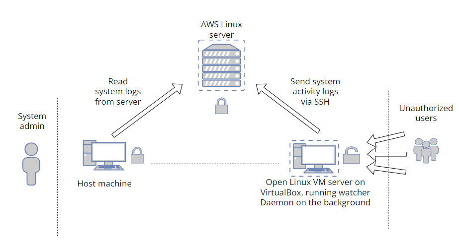

# System event monitor

A Linux Daemon for monitoring target file's / directory's events on a virtual machine with dummy data (honey pot), and sending monitoring information to a external server.

Purpose of this project was to learn about system's programming, code a small Linux Daemon for logging desired System events, and send the monitored information to a external server (host) via SSH.

The benefits of this are that we learn the possible directories and files the attackers / attack scripts may try to access, and protect the actual servers with non dummy information better.



Deamon (watcher) runs on the backround on the VM, monitoring the set target(s). After monitoring is stopped with a signal, the program connects to the external server via SSH, and sends the logfile to desired directory on the server.
TODO: Change so that the daemon send the logs in time cycles to aws server? or host machine. AWS maybe be better if the attacker gets the ssh details, the host machine could get compromised. honey pot VM needs strong authentication and permissions need to be in check to avoid unauthenticated reading of ssh details.

## Preperations

SSH connection from the VM to the server needs to be established first. When creating a AWS server, a keypair is usually generated.

Check SSH status on VM with
``` bash
sudo systemctl status ssh
```

If SSH is disabled
``` bash
sudo systemctl enable ssh
```
``` bash
sudo systemctl start ssh
```
The created SSH key needs to be delivered to the VM for establishing SSH connection later on without password authentication.
The key should be added to the ssh directory and only the user should have full read-write permission to it. This is very important so that the SSH details don't get compromised when opening the VM for outside connections.
``` bash
/etc/ssh/created_key
```
``` bash
sudo chmod 600 created_key
```
Use of best practices when creating and using SSH keys is adviced.

``` bash
ssh -i /etc/ssh/created_key username@remotehost
```

Now the VM should be able to connect to the external server without password authentication.

## Daemon usage

``` bash
make && make clean
```

``` bash
./watcher [/path/to/target]
```
The Daemon starts monitoring the set target, and logging the events to a logfile. Also Linux system notifications are displayed after each event for clarity. TODO: Maybe add a choice to remove the system notifications
Monitoring can be stopped with a signal (Ctrl + C), and then the program will connect to the host machine and send the logging file to the set destination directory. Note that the connected user should have writing permissions for the destination folder.
