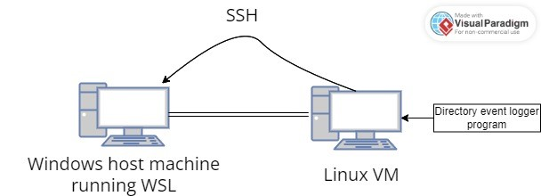

# System event monitor

A Linux Daemon for monitoring target file's / directory's events, and sending monitoring information to a external server.

Purpose of this project was to learn about system's programming, code a small Linux Daemon for logging desired System events, and send the monitored information to a external server (host) via SSH.



Deamon (watcher) runs on the backround on the VM, monitoring the set target. After monitoring is stopped with a signal, the program connects to the host machine via SSH, and sends the log file to desired host machine directory.

## Preperations

SSH connection from the VM to the host machine needs to established first. SSH needs to enabled for host and the VM.

Check SSH status with
``` bash
sudo systemctl status ssh
```

If SSH is disabled
``` bash
sudo systemctl enable ssh
```
``` bash
sudo systemctl start ssh
```

A keypair needs to be created so that VM can connect without the password.
Example
``` bash
ssh-keygen -b 2048 -t rsa
```
Use of best practices when creating and using SSH keys is adviced.

Public key can copied to the host machine
``` bash
ssh-copy-id username@remote_host
```
Password for the host is required in this step. After this, a connection can be established without entering the password every time.

## Daemon usage

``` bash
make && make clean
```

``` bash
./watcher [/path/to/target]
```
The Daemon starts monitoring the set target, and logging the events to a logfile. Also Linux system notifications are displayed after each event for clarity.
Monitoring can be stopped with a signal (Ctrl + C), and then the program will connect to the host machine and send the logging file to the set destination directory. Note that the connected user should have writing permissions for the destination folder.
